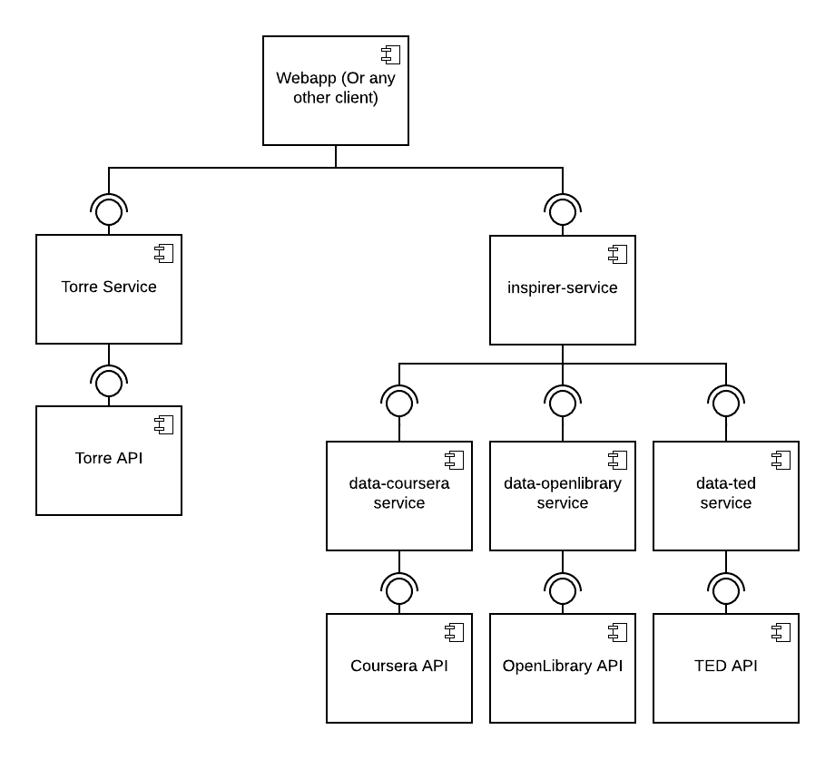

# inspire.me

[](https://travis-ci.org/agurodriguez/inspire.me)

## Run

```
npm start
```

## Develop

### Architecture

<p align="center">
    
    <br />
    <sup>Components diagram (Second draft)</sup>
</p>

### Tests

The project is being tested at the [integration](https://en.wikipedia.org/wiki/Integration_testing) level. The tests are written using [Postman](https://www.getpostman.com) (See https://blog.getpostman.com/2017/10/25/writing-tests-in-postman) and executed using [newman](https://github.com/postmanlabs/newman) automatically via Travis.

### Data Providers

Data Provider is the concept behind `data-*-service` micro-services. A Data Provider is a software componente responsible for feeding data to the system. Any [hydra service](https://www.hydramicroservice.com/docs/hydra-core/getting-started.html) can be a Data Provider, it just needs to follow the following specification:

* It should serve a HTTP REST API with -at least- one `GET` endpoint with this signature: `http://{url}/v1/data?subject=${subject}`.

* It should give a `JSON` response with the following structure:

    * Positive response (No error):

        ```json
        {
            "statusCode": 200,
            "statusMessage": "OK",
            "statusDescription": "Request succeeded without error",
            "result": [
                { ... }
            ]
        }
        ```

    * Negative response (Error):

        ```json
        {
            "statusCode": 500,
            "statusMessage": "Server Error",
            "statusDescription": "An error occurred on the server",
            "result": {
                "error": "..."
            }
        }
        ```
